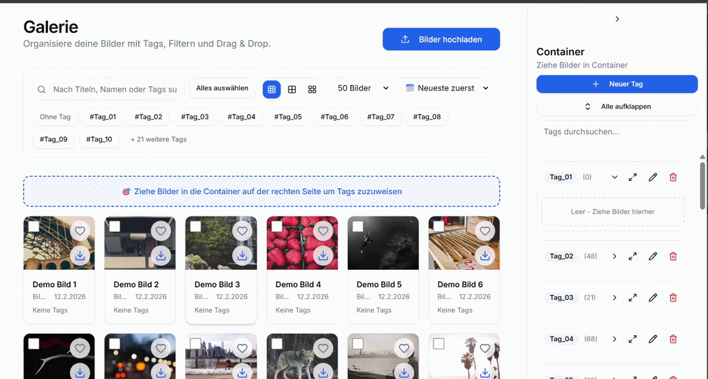

# Drag Gallery

Eine installierbare Web-App (PWA) zur Bildverwaltung mit Drag & Drop, Tagging und Galerie-Ansichten. Gebaut mit Next.js, Postgres und S3-kompatibler Objektspeicherung.

---

## Features im Überblick

### Drag & Drop Tag-Zuweisung

Bilder per Drag & Drop auf Tags ziehen, um sie zuzuordnen — einzeln oder als Batch-Auswahl.



---

### Upload per Dropzone

Dateien einfach irgendwo auf die Seite ziehen — ein Fullscreen-Overlay öffnet sich und der Upload startet. Vorschau-Thumbnails, Duplikaterkennung und automatische AVIF-Konvertierung inklusive.

<!-- TODO: GIF aufnehmen -->


---

### Insta Mode

Fullscreen-Ansicht im Instagram-Stil: Bilder durchswipen, per Doppeltipp liken (mit Herz-Animation), Like-Zähler und Liker-Avatare sehen.

<!-- TODO: GIF aufnehmen -->


---

### Tag-Filter & Suche

Tags als Badges anklicken, Textsuche über Titel und Tags, Filter für ungetaggte Bilder — alles kombinierbar.

<!-- TODO: GIF aufnehmen -->


---

### Bilddetail mit Inline-Bearbeitung

Bild anklicken → Dialog mit voller Auflösung, editierbarem Namen und Tag-Autocomplete.

<!-- TODO: GIF aufnehmen -->


---

### Grid-Layout anpassen

Zwischen drei Dichte-Stufen wechseln, Bilder pro Seite einstellen und nach Datum oder Name sortieren.

<!-- TODO: GIF aufnehmen -->


---

## Tech Stack

| Bereich | Technologie |
|---|---|
| Framework | Next.js (App Router), TypeScript, React 19 |
| Styling | Tailwind CSS, shadcn/ui, Radix Primitives |
| Drag & Drop | @dnd-kit |
| Datenbank | PostgreSQL |
| Objektspeicher | MinIO / S3-kompatibel (Presigned Uploads) |
| Auth | Auth.js (NextAuth) — Credentials + optional GitHub |
| PWA | next-pwa, Service Worker, Manifest |

## Erste Schritte

```bash
npm install
cp .env.example .env   # anpassen
npm run dev
```

> Benötigt Node.js ≥ 18.

### User anlegen

```bash
node scripts/create-user.js admin MySecurePass123
```

## Projektstruktur

```
src/
├── app/           # Pages, API-Routen, Auth
├── components/    # Gallery, UI-Komponenten, Admin
├── lib/           # DB, Storage, Auth, Utilities
├── styles/        # Tailwind importieren, Basis Styles
└── types/         # TypeScript-Definitionen
```

## Ziele & Roadmap

### Performance & UX
- [ ] **Progressive Loading** mit Blur-Placeholders (LQIP)
- [ ] **Infinite Scroll** als Alternative zur Pagination
- [ ] **Keyboard Shortcuts** für Navigation und Aktionen (⌘/Ctrl+K für Suche, Pfeiltasten, etc.)

### KI & Smart Features
- [ ] **Auto-Tagging** — KI-basierte Tag-Vorschläge (OpenAI Vision, Google Vision API, oder lokal mit CLIP)
- [ ] **Ähnliche Bilder finden** — Visual Similarity Search mit Embedding-Vektoren
- [ ] **Smart Search** — Natürliche Sprache: "zeige mir alle Bilder von Sonnenuntergängen am Strand"
- [ ] **Object Detection** — Automatisches Erkennen von Objekten, Personen, Szenen
- [ ] **Auto-Crop-Vorschläge** — KI findet besten Bildausschnitt
- [ ] **Gesichtserkennung** — Personen automatisch taggen und gruppieren
- [ ] **Automatische Bildoptimierung** — AI-Upscaling, Entrauschen, HDR-Verbesserung
- [ ] **Content Moderation** — NSFW-Filter, automatische Flagging

### Bildverwaltung
- [ ] **Bildbearbeitung** — Crop, Filter, Helligkeit/Kontrast direkt im Browser
- [ ] **Duplikaterkennung** mit perceptual hashing (pHash/dHash)
- [ ] **Alben/Collections** — Bilder in Sammlungen gruppieren (zusätzlich zu Tags)

### Collaboration & Sharing
- [ ] **Öffentliche Galerie-Links** mit Ablaufdatum
- [ ] **Berechtigungssystem** — Read/Write/Admin-Rollen pro Galerie
- [ ] **QR-Code Generator** — Galerie-Links als QR-Code für Mobile-Sharing
- [ ] **Slideshow-Modus** — Fullscreen mit Transitions, optionaler Musik/Audio
- [ ] **Embed-Widget** — Galerie als iFrame auf anderen Websites einbetten
- [ ] **Social Media Integration** — Direct Share zu Instagram, Pinterest, Twitter

### UX & Präsentation
- [ ] **Heatmap-View** — Visualisierung nach Upload-Häufigkeit oder Likes
- [ ] **Themes** — Benutzerdefinierte Color Schemes, Gallery-Layouts
- [ ] **Gamification** — Badges für Milestones (100. Upload, 1. Like, etc.)

### Import & Export
- [ ] **Batch-Download** als ZIP
- [ ] **Backup-Automation** mit S3 Lifecycle Policies

### Admin & Monitoring
- [ ] **Storage-Dashboard** — Speicherverbrauch, größte Dateien
- [ ] **Analytics** — Most viewed, most liked, Upload-Statistiken
- [ ] **Audit Log** für sensible Aktionen
- [ ] **Tag-Verwaltung** — Umbenennen, Mergen, Löschen mit Preview, Berechtigungen zu bestimmten Tags

### Technische Verbesserungen
- [ ] **E2E-Tests** mit Playwright
- [ ] **Rate Limiting** für Upload-Endpoints
- [ ] **Observability** mit OpenTelemetry + Grafana

